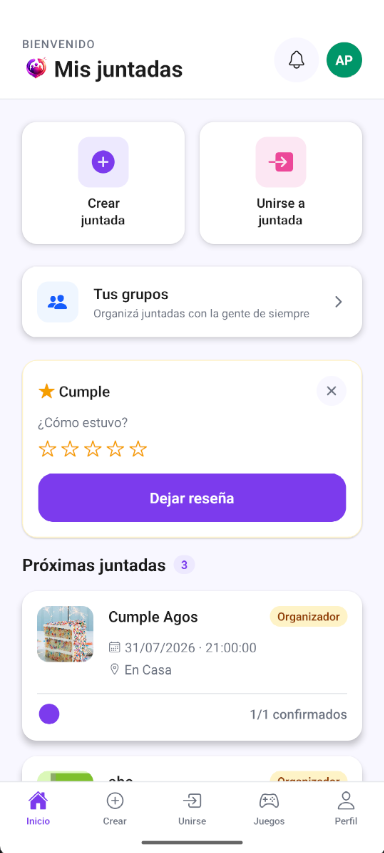
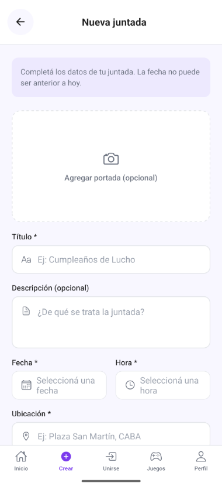
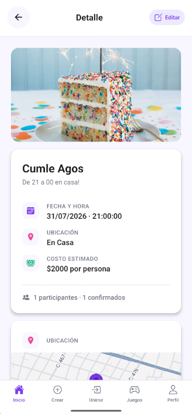
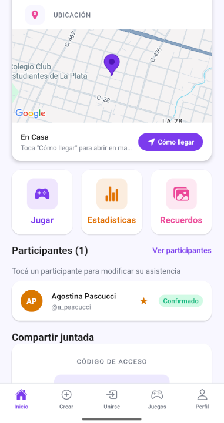
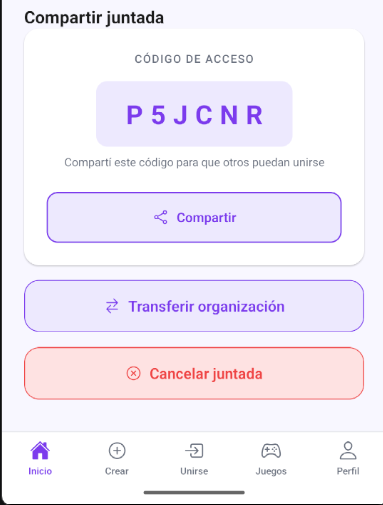
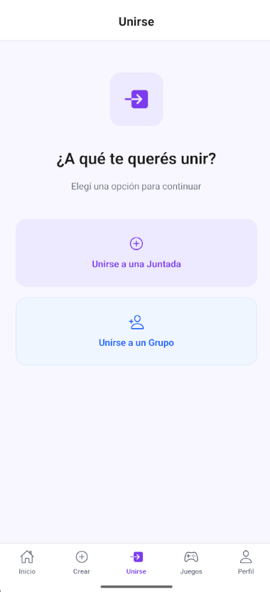
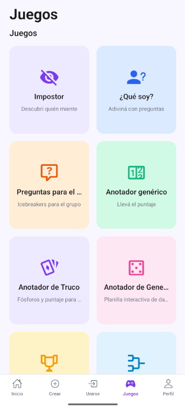
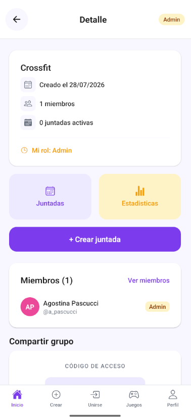

# 🍻 Ronda App

> Aplicación móvil para organizar juntadas entre amigos — TP Integrador 2026


**Ronda App** es una aplicación móvil multiplataforma (Android/iOS) que centraliza la coordinación de juntadas sociales entre amigos: desde la invitación y confirmación de asistencia hasta el registro de recuerdos, la gestión de grupos, la ubicación por mapa, juegos integrados y notificaciones en tiempo real.

---

## 📸 Screenshots











---

## ✨ Funcionalidades

### Entrega 1 — MVP Base
- 🔐 Autenticación completa (registro, login, logout) con Supabase Auth
- 📅 Crear y gestionar juntadas con código de unión único
- 👥 Gestión de asistencia por participante (confirmar / rechazar)
- 🃏 Juego **El Impostor** integrado con roles ocultos (offline, Zustand)
- 📷 Galería de recuerdos fotográficos por juntada
- 👤 Perfil de usuario con avatar y estadísticas

### Entrega 2 — Features Sociales
- 🖼️ Foto de portada para juntadas (cámara o galería)
- ⭐ Sistema de reseñas post-juntada (1-5 estrellas + comentario)
- 📤 Compartir juntada por WhatsApp o share nativo
- 🔔 Notificaciones push (FCM V1) e in-app en tiempo real con Supabase Realtime
- 🕹️ Hub de juegos expandido: ¿Qué Soy?, Preguntas de Grupo, Anotador, Temporizador, Equipos
- 🔑 Recuperación y cambio de contraseña con deep link (`rondaapp://reset-password`)
- 📜 Historial completo con búsqueda y filtros combinables (estado, rol, fechas)

### Entrega 3 — Grupos y Mapas
- 👥 **Gestión de Grupos**: crear, unirse por código, roles (admin/member), expulsar, transferir administración
- 📍 **Ubicación GPS** en juntadas: selector de punto en el mapa al crear/editar, "Cómo llegar" en detalle
- 🎮 Nuevos juegos: Anotador de Truco, Generala, Sorteador, Generador de Ligas y Torneos
- 📊 Estadísticas de juntadas individuales y por grupo
- 🧪 Suite de **51 tests unitarios** (authService, meetupService)
- ✨ Animaciones de entrada, shimmer skeletons y feedback táctil

---

## 🚀 Tecnologías

| Capa | Tecnología |
|---|---|
| Framework | React Native 0.83 + Expo SDK 55 |
| Lenguaje | TypeScript 5.9 (Strict Mode) |
| Backend & Auth | Supabase (PostgreSQL, RLS, Edge Functions) |
| Estado Global | Zustand 5 (juego Impostor) |
| Server State | TanStack Query v5 |
| Navegación | React Navigation 7 (Native Stack) |
| Formularios | React Hook Form 7 + Zod 4 |
| Mapas | react-native-maps 1.27 + Google Maps API |
| Notificaciones | Expo Notifications + FCM V1 |
| Build en la nube | EAS Build |
| Testing | Jest 29 + Testing Library React Native |

---

## 📋 Prerrequisitos

- **Node.js** v18.0.0 o superior
- **npm** (incluido con Node.js)
- **Expo Go** instalado en tu dispositivo físico ([Android](https://play.google.com/store/apps/details?id=host.exp.exponent) / [iOS](https://apps.apple.com/app/expo-go/id982107779))
- Una instancia de **Supabase** configurada con las migraciones del proyecto
- Una **Google Maps API Key** habilitada para Android

---

## ⚙️ Instalación

### 1. Clonar el repositorio

```bash
git clone https://github.com/Nicoperez04/juntadas-app.git
cd juntadas-app/mobile
```

### 2. Instalar dependencias

```bash
npm install
```

### 3. Configurar variables de entorno

Copia el archivo de ejemplo y completá los valores:

```bash
cp .env.example .env
```

Abrí `mobile/.env` y completá los tres valores:

```env
EXPO_PUBLIC_SUPABASE_URL=tu_supabase_url_aqui
EXPO_PUBLIC_SUPABASE_ANON_KEY=tu_supabase_anon_key_aqui
EXPO_PUBLIC_GOOGLE_MAPS_API_KEY=tu_google_maps_api_key_aqui
```

> **Seguridad:** El archivo `.env` está excluido del repositorio vía `.gitignore`.
> El archivo `google-services.json` (Firebase) está incluido en el repo ya que es necesario para el build. Su API Key está restringida en Google Cloud Console al package name `com.rondaapp.mobile` y al SHA-1 del APK firmado, por lo que no puede ser utilizada fuera de la app oficial.

---

## 📱 Ejecutar el proyecto

Dentro de la carpeta `mobile/`:

```bash
npm start
```

| Opción | Comando / Acción |
|---|---|
| Dispositivo físico (recomendado) | Escanear el QR con Expo Go (misma red Wi-Fi) |
| Emulador Android | Presionar `a` en la terminal |
| Simulador iOS (solo macOS) | Presionar `i` en la terminal |
| USB (Android) | `npm run start:usb` |
| Tunnel (redes distintas) | `npm run start:tunnel` |

---

## 🏗️ Build con EAS (generar APK)

Asegurate de tener el CLI de EAS instalado:

```bash
npm install -g eas-cli
eas login
```

**APK de preview** (instalar directamente en dispositivo):

```bash
eas build --platform android --profile preview
```

**APK de development** (con dev client):

```bash
eas build --platform android --profile development
```

---

## 🧪 Tests

```bash
npm test
```

La suite incluye **51 tests unitarios** sobre `authService` y `meetupService`.

---

## 📁 Estructura del proyecto

```
juntadas-app/
├── mobile/                    # Código fuente de la app
│   ├── src/
│   │   ├── config/            # Variables de entorno y tokens de diseño
│   │   ├── lib/supabase/      # Cliente centralizado de Supabase
│   │   ├── navigation/        # Flujos de navegación tipados
│   │   ├── shared/            # Componentes, hooks y utilidades reutilizables
│   │   └── features/          # Módulos por dominio:
│   │       ├── auth/          # Registro, login, perfil
│   │       ├── meetups/       # Juntadas (crear, editar, detalle, historial)
│   │       ├── groups/        # Grupos (crear, unirse, miembros, roles)
│   │       ├── participants/  # Gestión de asistencia
│   │       ├── memories/      # Galería de recuerdos
│   │       ├── reviews/       # Reseñas post-juntada
│   │       ├── notifications/ # Notificaciones push e in-app
│   │       ├── games/         # Hub de juegos
│   │       ├── impostor/      # Juego El Impostor (offline, Zustand)
│   │       └── gameResults/   # Estadísticas de partidas
│   └── app.config.js          # Configuración dinámica de Expo
├── supabase/
│   └── migrations/            # Migraciones SQL (PostgreSQL)
├── docs/                      # Documentación del proyecto
├── ia/                        # Prompts y reflexiones de uso de IA
└── CHANGELOG.md               # Historial de cambios por entrega
```

---

## 👥 Equipo de Desarrollo

| Integrante | GitHub |
|---|---|
| Egüen Agustina Pilar | [@aguseguen](https://github.com/aguseguen) |
| Pascucci Agostina | [@agostinapascucci](https://github.com/agostinapascucci) |
| Perez Nicolás Agustín | [@Nicoperez04](https://github.com/Nicoperez04) |
| Smith Justina | [@justinasmith1](https://github.com/justinasmith1) |
| Talavera Santiago Ariel | [@SantiTalavera](https://github.com/SantiTalavera) |


