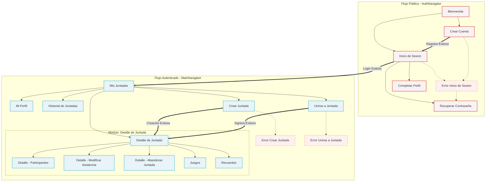

# Documento Técnico - Date App - Entrega 1
**Grupo:** Egüen Agustina, Pascucci Agostina, Perez Nicolas, Smith Justina, Talavera Santiago 
**Fecha de Actualización:** 23/05/2026 
**Versión / Entrega:** Entrega 1 - MVP Básico

---
### Resumen de Decisiones Técnicas (Entrega 1)

El proyecto **Date App** se sustenta en una arquitectura moderna y modular, priorizando el desarrollo ágil y la escalabilidad progresiva exigida para las próximas entregas. Las decisiones técnicas fundamentales se resumen a continuación:

| Categoría | Decisión Técnica | Descripción |
| :--- | :--- | :--- |
| **⚛️ Tecnología Base** | React Native (Expo) y TypeScript | Desarrollo móvil ágil y multiplataforma, priorizando el tipado estricto para modelar las entidades del dominio de forma segura. |
| **📱 Versiones Mínimas Soportadas** | Android Android 7.0 (API Level 24) y iOS 13.0+ | Se establece como requisito técnico mínimo para la ejecución de la aplicación, asegurando compatibilidad con la mayoría de dispositivos modernos y cumpliendo con las directrices del curso. |
| **🌿 Versionado y Estructura** | Git y GitHub | Estrategia de ramas donde `entrega-1` centraliza el código del MVP. El repositorio separa responsabilidades en directorios claros: código móvil (`mobile/`), configuración backend (`supabase/`), documentación y uso de IA. |
| **🗄️ Backend Administrado** | Supabase | Resuelve de forma integrada la base de datos relacional (PostgreSQL), autenticación inicial (Auth) y almacenamiento de imágenes (Storage), descartando el desarrollo de una API propia para esta etapa. |
| **🧠 Gestión de Estado** | TanStack Query + Zustand | Enfoque híbrido: TanStack Query maneja exclusivamente las peticiones y caché remoto de Supabase, mientras que Zustand administra el estado global liviano de la interfaz de usuario. |
| **🧭 Navegación y Formularios** | React Navigation + React Hook Form (Zod) | División lógica de flujos de navegación (rutas públicas vs. autenticadas) y manejo robusto, seguro y tipado de todos los formularios de la aplicación. |
| **🤖 Uso de IA** | Asistencia documentada | Empleo de IA generativa como apoyo técnico, registrado bajo un protocolo estricto en la carpeta `/ia/`, guardando conversaciones completas sobre arquitectura, *prompts* y *debugging*. |

---

## Decisión de Tecnología
### 🌿D01 - Herramienta de versionado y repositorio

El proyecto utilizará **Git y GitHub** como sistema de control de versiones y repositorio remoto principal.

**Justificación:**
Se elige GitHub porque es la plataforma más adecuada para centralizar el código fuente del proyecto, mantener trazabilidad del desarrollo y cumplir con los requisitos de entrega de la materia. Permite trabajar con ramas, registrar commits, crear Pull Requests, documentar el proyecto mediante `README.md`, etiquetar versiones mediante tags y compartir el repositorio de forma clara con la cátedra.

**Uso previsto en el proyecto:**
- Crear un repositorio único para la aplicación móvil.
- Mantener el código fuente actualizado en GitHub.
- Usar ramas para separar el desarrollo de funcionalidades.
- Registrar cambios mediante commits descriptivos.
- Usar Pull Requests internos para revisar e integrar cambios.
- Mantener un `README.md` con instrucciones para clonar, configurar y ejecutar el proyecto.
- Crear una rama específica para la Entrega 1.
- Crear un tag sobre el commit final que se entregue a la cátedra.
- Evitar subir credenciales, claves privadas o archivos `.env` reales al repositorio.

### 🌿D02 — Estrategia de ramas Git

El proyecto utilizará una estrategia de ramas simple basada en una rama principal `main`, una rama integradora para la primera entrega llamada `entrega-1` y ramas de funcionalidad con el prefijo `feature/`.

La estructura inicial será:

```
main
└── entrega-1
    ├── feature/setup-project
    ├── feature/navigation
    ├── feature/create-meetup
    ├── feature/participants
    ├── feature/games
    └── feature/album
```

**Justificación:**
Se elige esta estrategia porque permite mantener una rama estable y clara para la entrega sin agregar complejidad innecesaria. La rama `main` queda reservada como rama principal del proyecto, mientras que `entrega-1` funciona como rama integradora de todo el trabajo correspondiente al MVP básico.

Las ramas `feature/*` permiten desarrollar cada funcionalidad de forma separada, evitando mezclar cambios de distintas partes de la aplicación. Esto facilita el trabajo colaborativo, la revisión del código y la integración progresiva del proyecto.

No se incorpora una rama `develop` en esta etapa porque, para el alcance de la Entrega 1, sumaría una capa adicional de organización que no aporta demasiado valor. La rama `entrega-1` cumple el rol de integración durante esta primera etapa.

**Reglas de uso:**
- `main` se mantiene como rama principal y estable del proyecto.
- `entrega-1` concentra el código que formará parte de la primera entrega.
- Cada nueva funcionalidad o cambio relevante se desarrolla en una rama `feature/nombre-descriptivo`.
- Las ramas `feature/*` se integran a `entrega-1` mediante Pull Request.
- Antes de integrar una rama, se debe verificar que la aplicación compile y que el flujo afectado funcione correctamente.
- Al finalizar la Entrega 1, se creará un tag sobre el commit final, por ejemplo `v1.0-entrega-1`.

### ⚛️ D03 — Tecnología principal de desarrollo móvil

El proyecto se desarrollará utilizando **React Native con Expo** como tecnología principal para la aplicación móvil.

**Justificación:**
Se elige React Native con Expo porque permite construir una aplicación móvil funcional de forma rápida, con una única base de código y con una configuración inicial más simple que un proyecto nativo tradicional.

Para el alcance de la Entrega 1, el foco principal está puesto en lograr un MVP demostrable, con pantallas navegables, formularios, componentes visuales, flujo de creación de juntadas, participantes, juegos simples y una primera aproximación al álbum o historial. En este contexto, React Native con Expo permite avanzar más rápido sobre la experiencia de usuario y reducir el tiempo dedicado a configuración nativa.

Expo facilita la creación del proyecto, la ejecución en dispositivo o emulador, la gestión de assets y la incorporación progresiva de funcionalidades móviles comunes. Además, permite realizar pruebas y demos con menor fricción, algo importante para una entrega académica con plazos definidos.

**Alternativas consideradas:**
Se consideró desarrollar la aplicación con Android nativo utilizando Kotlin o Java. Esta alternativa tiene la ventaja de trabajar directamente sobre Android y ofrecer mayor control sobre APIs nativas, pero para este proyecto implicaría mayor curva inicial y más tiempo de configuración antes de llegar a un MVP visual y funcional.

También se consideró Flutter, que es una alternativa válida para desarrollo multiplataforma, pero se descarta para esta etapa porque implicaría incorporar Dart y un ecosistema distinto al que se prioriza para el proyecto.

Por último, se consideró React Native sin Expo, pero no se justifica para la Entrega 1, ya que el proyecto no requiere inicialmente configuraciones nativas avanzadas. Expo ofrece suficiente flexibilidad para el MVP y reduce riesgos técnicos.

**Consecuencias:**
Esta decisión define que la aplicación se desarrollará en JavaScript/TypeScript y se ejecutará en el ecosistema de React Native, con Expo como herramienta de empaquetado y distribución inicial. Esto condiciona las decisiones sobre librerías, arquitectura y despliegue futuro, pero permite tener un MVP funcional en un plazo razonable para la entrega.

---
### 📱 D04 - Versión mínima de Sistemas Operativos

Android: Versión mínima soportada Android 7.0 (API Level 24).

iOS: Versión mínima soportada iOS 13.0.

**Justificación:**
Estas son las versiones mínimas históricas que exigen las versiones recientes del SDK de Expo y React Native para garantizar el soporte de sus librerías internas y parches de seguridad. Apuntar a APIs anteriores requeriría configuraciones nativas ("Bare Workflow") que romperían con la agilidad buscada al elegir Expo.

---

### ⚛️ D05 - Lenguaje principal

El proyecto utilizará **TypeScript** como lenguaje principal sobre React Native con Expo.

**Justificación:**
Se elige TypeScript porque permite desarrollar la aplicación con mayor seguridad, claridad y mantenibilidad que JavaScript puro. Al tratarse de una app con varias entidades del dominio, como juntadas, participantes, juegos, puntajes, álbum e historial, resulta conveniente definir tipos e interfaces desde el inicio.

TypeScript ayuda a detectar errores antes de ejecutar la aplicación, especialmente en el pasaje de datos entre pantallas, el uso de servicios, hooks, componentes reutilizables y modelos del dominio. Esto reduce errores comunes como nombres de propiedades incorrectos, datos faltantes o estructuras inconsistentes.

Además, el uso de TypeScript favorece el trabajo asistido por IA, ya que permite pedir código basado en tipos explícitos y revisar con mayor facilidad si lo generado respeta la estructura esperada del proyecto.

**Alternativa considerada:**Se consideró usar JavaScript por su simplicidad inicial, pero se descarta porque el proyecto tiene suficiente complejidad funcional como para beneficiarse de tipado estático. Aunque TypeScript requiere algo más de disciplina al comienzo, aporta mayor orden y escalabilidad para las próximas entregas.

**Consecuencias:**
El proyecto deberá definir tipos e interfaces para las entidades principales, como `Meetup`, `Participant`, `Game`, `Score`, `AlbumItem` y `User`. También se deberá mantener tipado el sistema de navegación, las props de componentes, los hooks y los servicios de acceso a datos.

Esta decisión puede agregar algo de trabajo inicial, pero reduce errores y facilita la evolución del proyecto en Entrega 2 y Entrega 3.

---

### 🗄️ D06 - Estrategia de Backend y Persistencia de Datos

El proyecto utilizará **Supabase como backend administrado** como fuente principal de datos. Se utilizará su plataforma para resolver de forma integrada la base de datos (PostgreSQL), la autenticación y el almacenamiento de archivos, conectando la aplicación móvil directamente a través de su cliente oficial. Por lo tanto, no se implementará inicialmente un backend propio (API REST / Express / ORM).

**Justificación**
La naturaleza colaborativa de la aplicación exige una fuente compartida de datos, ya que los usuarios interactúan sobre entidades comunes (juntadas, participantes, fotos, puntajes). Supabase permite cubrir estas necesidades utilizando un modelo relacional que se adapta perfectamente al dominio del proyecto y facilita la documentación técnica.
Al optar por un backend administrado, se evita la enorme carga técnica de desarrollar, probar y desplegar una API completa desde cero (rutas, controladores, middlewares, ORM), permitiendo al equipo concentrar los esfuerzos en el objetivo central de la materia: desarrollar una aplicación móvil funcional y escalable.

**Arquitectura y Flujo de Datos**
En lugar de utilizar una arquitectura tradicional de servidor, que sumaría capas innecesarias de desarrollo (`App móvil → API Express → ORM → Base de datos`), el proyecto adoptará un flujo directo y seguro:
`App móvil → Cliente Supabase → Supabase Auth / PostgreSQL / Storage`
La lógica de acceso a datos no se programará en un servidor intermedio, sino que estará encapsulada del lado de la app móvil en *servicios* organizados por *feature* (ej. `meetupService`), evitando así consultas SQL dispersas en los componentes de la interfaz.

**Alcance Progresivo de Implementación**
Supabase permite adoptar sus funcionalidades de manera incremental, alineándose con las entregas de la cátedra:

* **Entrega 1 (MVP):** Uso acotado a validar el flujo principal. Se implementará la creación, listado y consulta de juntadas, y el registro básico de participantes. Si los tiempos apremian, se podrán usar datos *mock* temporalmente, pero la arquitectura nace orientada a Supabase.
* **Entregas 2 y 3:** Se incorporarán funcionalidades complejas como autenticación completa de usuarios, reglas avanzadas de permisos (RLS), códigos de acceso, almacenamiento multimedia definitivo e historiales.

**Alternativas Consideradas**

* **Firebase:** Se consideró por ser un backend administrado muy popular, pero se descartó porque su base de datos NoSQL se adapta menos a nuestro modelo de entidades altamente interrelacionadas. PostgreSQL resulta más intuitivo para este dominio.
* **Backend propio (Node.js/Java):** Se descartó por sumar demasiada complejidad operativa para el alcance del MVP, desviando el foco del desarrollo móvil.

**Consecuencias**
Esta decisión simplifica drásticamente el arranque del proyecto. A cambio, requiere que el equipo sea disciplinado en organizar correctamente la lógica dentro de Supabase: las tablas, relaciones, *scripts* SQL de migración y, especialmente, las políticas básicas de seguridad (RLS). Si en etapas futuras aparece una necesidad de negocio demasiado compleja para ser resuelta desde el cliente, se podrá reevaluar la incorporación de una API propia o *Edge Functions*, pero para la Entrega 1, Supabase cubre todas las necesidades estructurales.


### 🗄️ D07 - Estrategia de datos para Entregar 1

Aunque Supabase será utilizado desde el inicio, las pantallas no deberían quedar acopladas directamente a consultas dispersas dentro de los componentes visuales. Se definirá una capa de servicios o hooks de acceso a datos para encapsular las operaciones principales.

Por ejemplo:

```tsx
createMeetup(data)
getMeetups()
getMeetupById(id)
addParticipant(meetupId, participantData)
getParticipants(meetupId)
```

### 🗄️D08 — Modelo de datos mínimo para Entrega 1
Para la Entrega 1 se definirá un modelo de datos inicial en Supabase que permita cubrir el ciclo básico del MVP:

crear una juntada → sumarse o participar → usar una dinámica simple → guardar un recuerdo.

El modelo mínimo estará compuesto por las siguientes entidades:

- `auth.users`, gestionada por Supabase Auth.
- `profiles`, para los datos visibles del usuario dentro de la app.
- `meetups`, para representar las juntadas.
- `meetup_participants`, para representar la participación de usuarios en juntadas.
- `impostor_games`, para representar la dinámica social de Impostor.
- `memories`, para representar las fotos o recuerdos compartidos de una juntada.

**Justificación:**
La Entrega 1 no se limitará a una demo visual aislada, sino que buscará representar el flujo principal de la aplicación con persistencia real desde Supabase. Como el alcance incluye acceso básico de usuario, gestión de juntadas, participación, una dinámica social y recuerdos compartidos, el modelo de datos necesita cubrir esos módulos desde el inicio.

Supabase Auth se utilizará como base para el acceso de usuarios mediante registro e inicio de sesión. Sobre esa autenticación se agregará una tabla `profiles`, destinada a guardar información visible dentro de la app, como nombre, usuario o avatar.

La tabla `meetups` será el núcleo del módulo de organización, ya que contendrá la información principal de cada juntada. La tabla `meetup_participants` permitirá vincular usuarios con juntadas, registrar asistencia, diferenciar organizador y participante, y permitir acciones como unirse o abandonar una juntada.

Para la dinámica social de E1 se incorpora una entidad específica `impostor_games`, ya que el primer juego elegido será Impostor. Esta tabla permitirá asociar una partida o dinámica a una juntada y guardar la información mínima necesaria para mostrar roles o consignas.

Finalmente, la tabla `memories` permitirá guardar los recuerdos compartidos de la juntada, limitados en E1 a fotos. Videos, edición avanzada y funciones sociales más complejas quedan fuera del alcance inicial.

**Entidades iniciales:**

#### `profiles`

Representa la identidad básica del usuario dentro de la aplicación.

Campos tentativos:

```text
id
full_name
username
avatar_url
created_at
updated_at
```

El campo `id` estará asociado al usuario autenticado en Supabase Auth.

#### `meetups`

Representa una juntada creada por un usuario.

Campos tentativos:

```
id
title
description
date
time
location
estimated_cost
status
join_code
created_by
created_at
updated_at
cancelled_at
```

Estados posibles:

```
active
cancelled
finished
```

#### `meetup_participants`

Representa la relación entre usuarios y juntadas.

Campos tentativos:

```
id
meetup_id
user_id
role
attendance_status
joined_at
updated_at
left_at
```

Roles iniciales:

```
organizer
participant
```

Estados de asistencia iniciales:

```
confirmed
pending
declined
```

#### `impostor_games`

Representa una dinámica o partida simple de Impostor asociada a una juntada.

Campos tentativos:

```
id
meetup_id
created_by
topic
normal_prompt
impostor_prompt
impostor_user_id
status
created_at
started_at
finished_at
```

Estados posibles:

```
created
active
finished
```

#### `memories`

Representa los recuerdos compartidos de una juntada. En E1 se limitará a fotos.

Campos tentativos:

```
id
meetup_id
uploaded_by
file_url
file_path
caption
media_type
created_at
```

Para E1, `media_type` será inicialmente:

```
photo
```

**Funcionalidades cubiertas:**

Este modelo permite cubrir las siguientes funcionalidades de E1:

- Crear cuenta.
- Iniciar sesión.
- Mantener perfil mínimo.
- Crear juntada.
- Ver juntadas del usuario.
- Consultar detalle de juntada.
- Editar juntada.
- Cancelar juntada.
- Unirse a una juntada por código.
- Visualizar participantes.
- Registrar o modificar asistencia.
- Abandonar una juntada.
- Iniciar dinámica de Impostor.
- Mostrar rol o consigna.
- Subir fotos como recuerdos.
- Visualizar galería de recuerdos.
- Consultar historial básico de juntadas.

---
### 🧭 D09 — Arquitectura y estructura del proyecto
El proyecto utilizará una estructura de repositorio separada por responsabilidades, con una carpeta principal para la aplicación móvil, una carpeta para la configuración versionable de Supabase, una carpeta de documentación y una carpeta destinada al registro del uso de IA.

La estructura general será:

```
juntadas-app/
├── mobile/
├── supabase/
├── docs/
├── ia/
├── README.md
└── .gitignore
```

Dentro de `mobile/` se organizará el frontend con una arquitectura modular por features, manteniendo carpetas compartidas para componentes, utilidades y configuración global.

La estructura inicial propuesta para la app móvil será:

```
mobile/
├── app.json
├── package.json
├── tsconfig.json
├── .env.example
├── assets/
└── src/
    ├── app/
    │   ├── navigation/
    │   └── providers/
    │
    ├── config/
    │   ├── env.ts
    │   └── appConfig.ts
    │
    ├── features/
    │   ├── auth/
    │   ├── meetups/
    │   ├── participants/
    │   ├── impostor/
    │   └── memories/
    │
    ├── shared/
    │   ├── components/
    │   ├── constants/
    │   ├── hooks/
    │   ├── utils/
    │   └── types/
    │
    └── lib/
        └── supabase/
            ├── client.ts
            └── database.types.ts
```

La carpeta `supabase/` contendrá la parte versionable del backend administrado:

```
supabase/
├── migrations/
├── seed.sql
└── README.md
```

**Justificación:**

Se elige esta arquitectura porque permite separar de forma clara el frontend móvil, la configuración del backend administrado, la documentación y la evidencia del uso de IA. Esta separación facilita el trabajo del grupo, la revisión del proyecto y la futura preparación de la entrega.

Dentro de la app móvil, la organización por features permite que cada módulo funcional tenga su propio espacio de trabajo. Esto se adapta bien al dominio del proyecto, que está compuesto por módulos diferenciados: autenticación, juntadas, participantes, dinámica de Impostor y recuerdos compartidos.

Esta estructura evita que el proyecto crezca como una carpeta plana con pantallas, servicios y tipos mezclados. En cambio, cada feature puede contener sus propias pantallas, componentes, hooks, servicios, validaciones y tipos cuando corresponda.

La carpeta `shared/` se reserva para elementos realmente reutilizables por varios módulos, como botones, inputs, cards, estados de carga, estados de error, constantes visuales, hooks generales, utilidades y tipos compartidos.

La carpeta `lib/` se utiliza para clientes o integraciones externas. En este caso, `lib/supabase/` centralizará la configuración del cliente de Supabase y los tipos generados o definidos a partir de la base de datos.

**Separación frontend/backend:**

Aunque el proyecto no tendrá inicialmente un backend propio con Express, se mantiene una separación entre:

```
mobile/    → aplicación móvil React Native + Expo
supabase/  → backend administrado: migraciones, seed y configuración
```

Esto permite versionar la estructura de la base de datos y mantener separada la lógica de la aplicación móvil de la configuración del backend administrado.

Las operaciones de negocio del frontend se ubicarán dentro de los servicios de cada feature. Por ejemplo:

```
mobile/src/features/auth/services/authService.ts
mobile/src/features/meetups/services/meetupService.ts
mobile/src/features/memories/services/memoryService.ts
```

Estos servicios encapsularán las llamadas al cliente de Supabase, evitando que las pantallas realicen consultas directas de forma dispersa.

**Consecuencias:**

Esta arquitectura facilita el desarrollo incremental, el uso ordenado de IA y la escalabilidad hacia Entrega 2 y Entrega 3. Cada módulo puede desarrollarse, revisarse y modificarse de manera relativamente independiente.

También ayuda a documentar mejor el proyecto, ya que la estructura del repositorio refleja las responsabilidades principales del sistema.

Como consecuencia, el grupo deberá mantener disciplina para no colocar archivos compartidos innecesariamente en `shared/` y para evitar que las pantallas acumulen lógica de acceso a datos. La lógica de integración con Supabase deberá quedar encapsulada en servicios, hooks o módulos específicos.

---
### 🧭 D10 — Navegación de la aplicación

La aplicación utilizará **React Navigation** como solución principal para manejar la navegación entre pantallas.

La navegación se organizará en dos flujos principales:

- `AuthNavigator`, para pantallas de acceso de usuarios no autenticados.
- `MainNavigator`, para pantallas principales de usuarios autenticados.

La estructura inicial será:

```
mobile/src/app/navigation/
├── AppNavigator.tsx
├── AuthNavigator.tsx
├── MainNavigator.tsx
└── routes.ts
```

**Justificación:**

Se elige React Navigation porque es una solución ampliamente utilizada en React Native, compatible con Expo y flexible para organizar flujos de navegación según el estado de autenticación del usuario.

Esta elección se adapta bien a la arquitectura modular definida para el proyecto, ya que permite mantener las pantallas dentro de sus respectivas features y centralizar la configuración de navegación en `mobile/src/app/navigation/`.

Además, React Navigation facilita la creación de un diagrama de navegación claro para la documentación técnica de la Entrega 1, ya que permite representar explícitamente los flujos, pantallas y relaciones entre ellas.

**Flujo de navegación previsto para E1**

**Flujo no autenticado — `AuthNavigator`**

Pantallas iniciales:

```
WelcomeScreen
LoginScreen
RegisterScreen
ForgotPasswordScreen
```

**Flujo autenticado — `MainNavigator`**

Pantallas principales:

```
MeetupHomeScreen
CreateMeetupScreen
JoinMeetupScreen
MeetupDetailScreen
EditMeetupScreen
ParticipantListScreen
ImpostorStartScreen
ImpostorRoleScreen
MemoriesGalleryScreen
UploadMemoryScreen
MeetupHistoryScreen
ProfileScreen
```

Para la Entrega 1 se priorizará el uso de navegación tipo **Stack Navigator**, ya que permite representar de forma simple el flujo principal de la app. Si el diseño visual o la experiencia de usuario lo requieren, se podrá evaluar más adelante la incorporación de navegación por tabs.

**Alternativa considerada:**

Se consideró **Expo Router** como alternativa, ya que se integra bien con Expo y permite una navegación basada en archivos. Sin embargo, para este proyecto se decide no utilizarlo inicialmente porque la estructura del código estará organizada por features, y React Navigation permite mantener esa separación de manera más explícita.

**Consecuencias:**

Esta decisión permite separar claramente las pantallas públicas de acceso y las pantallas internas de la aplicación. También facilita proteger el flujo principal para que solo esté disponible cuando exista una sesión activa.

El grupo deberá mantener tipadas las rutas y parámetros principales para evitar errores al navegar entre pantallas, especialmente en pantallas que dependan de un `meetupId`, como detalle de juntada, participantes, juego de Impostor y recuerdos.
 
---

### 🧠 D11 — Gestión de estado y datos remotos


La aplicación utilizará una estrategia combinada para la gestión de estado:

- **TanStack Query** para manejar datos remotos provenientes de Supabase.
- **Zustand** para manejar estado global liviano de la aplicación.
- Estado local de React para formularios, inputs y estados simples de UI.

Esta decisión separa claramente el estado que proviene del backend del estado propio de la interfaz o de flujos temporales de la app.

**Justificación:**

El proyecto trabajará desde la Entrega 1 con Supabase como fuente principal de datos. Por eso, información como juntadas, participantes, recuerdos, perfil de usuario y datos persistidos no debería manejarse manualmente como estado global tradicional. Para esos casos se utilizará TanStack Query, ya que permite resolver de forma ordenada la carga de datos, errores, cache, refetch e invalidación de consultas luego de crear, editar o eliminar información.

Por otro lado, Zustand se utilizará para estado global liviano que no representa directamente una consulta persistida en Supabase, sino información temporal o de coordinación dentro de la aplicación. Por ejemplo, puede servir para manejar una juntada activa seleccionada, preferencias de UI, estado temporal de una dinámica, pasos de un flujo o datos compartidos entre pantallas que no justifiquen una consulta remota.

El estado local de React se mantendrá para casos simples y propios de cada pantalla o componente, como valores de formularios, modales, switches, campos de texto o estados visuales puntuales.

**Responsabilidades**

**TanStack Query**

Se utilizará para:

```
listar juntadas
obtener detalle de juntada
listar participantes
crear, editar o cancelar juntadas
consultar recuerdos
subir o listar fotos
consultar datos persistidos del perfil
sincronizar datos con Supabase
manejar loading, error, cache y refetch
```

**Zustand**

Se utilizará para:

```
estado global liviano
juntada activa o seleccionada
preferencias temporales de UI
estado de flujos multi-paso
estado temporal de la dinámica Impostor
datos no persistidos o previos a guardar
```

**Estado local de React**

Se utilizará para:

```
inputs de formularios
modales
toggles
mensajes visuales simples
estados internos de componentes
selecciones puntuales dentro de una pantalla
```

**Organización prevista**

Cada feature podrá definir sus propios hooks para acceder a datos remotos mediante TanStack Query:

```
features/meetups/hooks/
├── useMeetups.ts
├── useMeetupDetail.ts
└── useCreateMeetup.ts
```

Estos hooks se apoyarán en servicios de la misma feature:

```
features/meetups/services/meetupService.ts
```

Zustand se ubicará en una carpeta de store o dentro de la feature correspondiente si el estado es específico de un módulo:

```
mobile/src/shared/store/
```

o, si el estado pertenece únicamente a una feature:

```
mobile/src/features/impostor/store/
```

**Alternativas consideradas:**

Se consideró utilizar únicamente Zustand para manejar todo el estado de la app, pero se descartó porque los datos provenientes de Supabase requieren manejo de cache, carga, errores, refetch e invalidación. Resolver todo eso manualmente en Zustand agregaría complejidad y riesgo de inconsistencias.

También se consideró usar solamente Context API, pero se descarta como solución principal porque no está pensada para manejo avanzado de datos remotos y puede volverse incómoda a medida que crecen los módulos.

Redux Toolkit se descarta para la Entrega 1 porque se considera más pesado de lo necesario para el alcance inicial del proyecto.

**Consecuencias:**

Esta decisión permite mantener una separación clara entre datos persistidos, estado global liviano y estado local de UI. También favorece pantallas más limpias, ya que la lógica de consulta y mutación de datos quedará encapsulada en hooks y servicios por feature.

El grupo deberá cuidar no duplicar innecesariamente en Zustand datos que ya estén siendo manejados por TanStack Query. Como regla general, los datos persistidos en Supabase se tratarán como datos remotos y se manejarán con TanStack Query.

---

### 🧭 D12 — Autenticación para Entrega 1

La aplicación utilizará **Supabase Auth con email y contraseña** como mecanismo inicial de autenticación para la Entrega 1.

El flujo de autenticación incluirá:

- Pantalla de bienvenida.
- Registro de usuario.
- Inicio de sesión.
- Cierre de sesión.
- Sesión persistente.
- Perfil mínimo de usuario.
- Recuperación de contraseña, si los tiempos de implementación lo permiten.

**Justificación:**

El alcance de la Entrega 1 incluye acceso básico de usuario, por lo que resulta necesario implementar un mecanismo de autenticación desde el inicio. Dado que el backend elegido es Supabase, se utilizará Supabase Auth para resolver el registro, inicio de sesión y administración básica de sesión.

Se elige email y contraseña porque es un flujo estándar, fácil de comprender, suficiente para el MVP y adecuado para una demo académica. Permite validar que cada usuario tenga identidad propia dentro de la app, pueda crear juntadas, unirse a otras, aparecer como participante y asociar recuerdos o acciones a su perfil.

Además, este enfoque evita sumar complejidad innecesaria con login social o magic links, que podrían requerir configuración adicional, manejo de enlaces profundos o dependencias externas que no son centrales para la Entrega 1.

**Perfil mínimo:**

Supabase Auth gestionará la identidad base del usuario. La aplicación utilizará además una tabla `profiles` para almacenar datos visibles dentro de la app, como nombre, usuario o avatar.

Esta separación permite mantener la autenticación delegada en Supabase y, al mismo tiempo, contar con información propia del dominio para mostrar participantes, organizadores y perfiles dentro de las juntadas.

**Alcance para E1:**

Para la primera entrega se priorizará:

- Crear cuenta con email y contraseña.
- Iniciar sesión.
- Mantener sesión activa.
- Cerrar sesión.
- Crear o consultar perfil mínimo.
- Asociar juntadas, participantes y recuerdos al usuario autenticado.

La recuperación de contraseña se considera deseable, pero podrá quedar como funcionalidad secundaria si los tiempos de implementación lo requieren.

**Consecuencias:**

Esta decisión permite que el proyecto tenga usuarios reales desde la primera entrega y que las acciones principales queden asociadas a una identidad. También obliga a manejar sesión, errores de autenticación, validaciones de formulario y navegación condicional entre flujo autenticado y no autenticado.

El grupo deberá cuidar que no se guarden credenciales en el repositorio y que las claves de Supabase se manejen mediante variables de entorno.

---
### 🧭 D13 — Formularios y validaciones

La aplicación utilizará **React Hook Form** para el manejo de formularios y **Zod** para la definición de esquemas de validación.

Para estados simples de interfaz que no representen formularios completos, se podrá utilizar estado local de React mediante `useState`.

**Justificación**

La Entrega 1 incluye varias pantallas basadas en formularios: registro, inicio de sesión, recuperación de contraseña, creación de juntadas, edición de juntadas, unión por código, perfil mínimo y carga de recuerdos. Manejar todos estos formularios manualmente con `useState` y validaciones dispersas podría generar código repetitivo y difícil de mantener.

React Hook Form permite administrar los valores del formulario, errores, envío y reseteo de forma más ordenada. Zod permite definir reglas de validación explícitas y reutilizables, separadas de la interfaz visual.

Esta combinación mejora la mantenibilidad del proyecto y facilita que las validaciones sean consistentes entre pantallas. También permite trabajar mejor con TypeScript, ya que los esquemas pueden ayudar a inferir o reforzar los tipos de datos esperados.

**Alcance en E1**

Se aplicará esta estrategia principalmente en:

- Registro de usuario.
- Inicio de sesión.
- Recuperación de contraseña, si se implementa.
- Perfil mínimo.
- Crear juntada.
- Editar juntada.
- Unirse a juntada por código.
- Carga de recuerdo/foto, si corresponde.

**Organización prevista**

Cada feature podrá definir sus propios esquemas de validación en una carpeta `schemas`.

Ejemplo:

```
mobile/src/features/auth/schemas/
├── loginSchema.ts
├── registerSchema.ts
└── forgotPasswordSchema.ts

mobile/src/features/meetups/schemas/
├── createMeetupSchema.ts
├── editMeetupSchema.ts
└── joinMeetupSchema.ts
```

Las pantallas consumirán estos esquemas a través de React Hook Form, evitando validaciones hardcodeadas directamente en los componentes.

**Consecuencias**

Esta decisión agrega dos dependencias al proyecto, pero mejora la organización de los formularios y reduce errores en el manejo de datos ingresados por el usuario.

El grupo deberá mantener los esquemas de validación separados de las pantallas y reutilizarlos cuando sea posible. También deberá cuidar que las validaciones del frontend no reemplacen las restricciones necesarias en la base de datos o en Supabase, sino que funcionen como una primera capa de control para mejorar la experiencia de usuario.

---

### 🧭 D14 — Librerías principales del proyecto

El proyecto utilizará un conjunto acotado de librerías principales, priorizando compatibilidad con Expo, claridad de implementación y relación directa con las funcionalidades de la Entrega 1.

Las librerías base del proyecto serán:

```
expo
react
react-native
typescript
@react-navigation/native
@react-navigation/native-stack
react-native-screens
react-native-safe-area-context
@supabase/supabase-js
@react-native-async-storage/async-storage
react-native-url-polyfill
@tanstack/react-query
zustand
react-hook-form
zod
@hookform/resolvers
expo-image-picker
expo-secure-store
```

Además, se dejan como librerías a evaluar durante el avance del diseño visual:

```
nativewind
tailwindcss
@expo/vector-icons
```

**Justificación:**

Las librerías elegidas responden a las decisiones técnicas principales del proyecto.

Expo, React Native y TypeScript forman la base tecnológica de la aplicación móvil. React Navigation se utilizará para la navegación entre pantallas, junto con las dependencias necesarias para su correcto funcionamiento en Expo.

Supabase JS será la librería principal para conectar la aplicación con Supabase, permitiendo trabajar con autenticación, base de datos y almacenamiento. También se incorporan dependencias necesarias para la integración con React Native, como Async Storage y URL Polyfill.

TanStack Query se utilizará para manejar datos remotos provenientes de Supabase, incluyendo estados de carga, error, cache, refetch e invalidación de consultas. Zustand se utilizará para estado global liviano que no represente directamente datos persistidos en el backend.

React Hook Form y Zod se utilizarán para manejar formularios y validaciones de forma ordenada, especialmente en pantallas como registro, inicio de sesión, creación de juntadas, edición de juntadas y unión por código.

Expo Image Picker se utilizará para seleccionar fotos desde el dispositivo en el módulo de recuerdos. Expo Secure Store queda incorporado como herramienta para almacenamiento seguro local cuando sea necesario, especialmente en relación con sesión o datos sensibles.

**Librerías a evaluar:**

NativeWind y TailwindCSS se dejan como alternativas a evaluar para el desarrollo de estilos y pantallas. Pueden resultar útiles si el grupo decide trabajar con una sintaxis de estilos basada en utilidades, especialmente al trasladar diseños desde Figma o Stitch. Sin embargo, no se incorporan todavía como decisión obligatoria para evitar sumar configuración innecesaria antes de validar si realmente aportan valor.

`@expo/vector-icons` también queda como dependencia a evaluar, en caso de que el diseño visual requiera íconos dentro de botones, navegación, cards o estados de interfaz.

**Criterio para incorporar nuevas dependencias:**

No se incorporarán nuevas librerías sin una necesidad concreta. Antes de agregar una dependencia, el grupo deberá evaluar:

- Qué problema resuelve.
- Si es compatible con Expo.
- Si simplifica realmente la implementación.
- Si puede reemplazarse con una solución propia simple.
- Si agrega complejidad innecesaria.
- Si todos los integrantes pueden entender su uso.
- Si debe ser mencionada en la documentación técnica.

**Consecuencias:**

Esta decisión permite mantener el stack del proyecto controlado y alineado con el alcance de la Entrega 1. También facilita la redacción posterior del documento técnico, ya que las dependencias principales estarán asociadas a decisiones concretas: navegación, backend, estado, formularios, validaciones y manejo de imágenes.

Las versiones exactas de cada librería se documentarán a partir del archivo `package.json` una vez creado e inicializado el proyecto, para evitar registrar versiones estimadas o incorrectas.

---

### 🗄️ D15 — Manejo de imágenes y recuerdos

Para la Entrega 1, el módulo de recuerdos se limitará a **fotos**. La aplicación permitirá seleccionar imágenes desde el dispositivo, subirlas a Supabase Storage y asociarlas a una juntada mediante la tabla `memories`.

La implementación se realizará utilizando:

```
Expo Image Picker
Supabase Storage
Tabla memories en Supabase
```

No se incluirán videos ni edición avanzada de archivos multimedia en E1.

**Justificación**

El módulo de recuerdos forma parte del ciclo principal de la aplicación: crear una juntada, participar, usar una dinámica social y guardar un recuerdo compartido. Por eso, resulta conveniente que la Entrega 1 incluya una versión funcional y acotada de esta característica.

Se decide trabajar solo con fotos para reducir el riesgo técnico. El manejo de videos implica mayor peso de archivos, tiempos de carga más altos, posibles problemas de reproducción, almacenamiento y permisos. Para validar el concepto de álbum compartido, las fotos son suficientes en esta etapa.

Expo Image Picker permitirá seleccionar imágenes desde el dispositivo. Supabase Storage se utilizará para almacenar los archivos, y la tabla `memories` guardará la referencia asociada a cada juntada.

**Alcance para E1**

El alcance inicial será:

- Acceder a la galería del dispositivo.
- Seleccionar una foto.
- Subir la foto a Supabase Storage.
- Registrar la foto en la tabla `memories`.
- Asociar cada recuerdo a una juntada.
- Visualizar las fotos de una juntada en una galería.
- Mostrar estados básicos de carga, error y galería vacía.

**Fuera de alcance para E1**

Quedan fuera de esta entrega:

- Videos.
- Captura obligatoria desde cámara.
- Edición de imágenes.
- Filtros.
- Comentarios sobre recuerdos.
- Likes o reacciones.
- Feed social.
- Organización avanzada del álbum.
- Compresión avanzada.
- Moderación de contenido.
- Eliminación masiva de recuerdos.

**Organización prevista**

La lógica del módulo se ubicará dentro de la feature `memories`.

Estructura esperada:

```
mobile/src/features/memories/
├── screens/
├── services/
├── hooks/
└── types.ts
```

Ejemplos de servicios o funciones:

```
pickImage()
uploadMemoryPhoto()
getMemoriesByMeetup()
createMemoryRecord()
```

La configuración general de Supabase Storage no estará dispersa en las pantallas, sino encapsulada en servicios o utilidades propias del módulo.

**Consecuencias**

Esta decisión permite mostrar una funcionalidad representativa del producto sin sobredimensionar la Entrega 1. También valida desde temprano la integración entre la app móvil, permisos del dispositivo, Supabase Storage y base de datos.

El grupo deberá prestar especial atención al manejo de permisos, errores de subida, nombres de archivo, rutas de storage y estados de carga. También deberá evitar que la pantalla de galería contenga directamente la lógica de subida o persistencia.

---

### ⚛️ D16 — Configuración y variables de entorno

El proyecto utilizará variables de entorno para manejar datos de configuración, especialmente los valores necesarios para conectar la aplicación móvil con Supabase.

La aplicación tendrá un archivo local:

```
mobile/.env
```

que no será subido al repositorio, y un archivo de ejemplo:

```
mobile/.env.example
```

que sí será versionado para indicar qué variables necesita configurar cada integrante.

**Justificación**

El proyecto utilizará Supabase desde la Entrega 1, por lo que la app necesita configurar valores como la URL del proyecto y la clave pública anónima. Estos valores no deben escribirse directamente dentro del código fuente.

La guía de la materia indica que el repositorio no debe contener credenciales hardcodeadas y que se deben utilizar archivos de configuración como `.env` o equivalentes. Por este motivo, se decide separar la configuración del código y documentar las variables necesarias mediante `.env.example`.

Además, centralizar la configuración evita que las variables de entorno se lean de manera dispersa en distintas pantallas o servicios.

**Variables iniciales**

Para la integración con Supabase se utilizarán inicialmente:

```
EXPO_PUBLIC_SUPABASE_URL=
EXPO_PUBLIC_SUPABASE_ANON_KEY=
```

Estas variables serán consumidas por la configuración del cliente Supabase.

**Organización prevista**

La configuración se centralizará en:

```
mobile/src/config/env.ts
mobile/src/config/appConfig.ts
```

El cliente de Supabase se configurará en:

```
mobile/src/lib/supabase/client.ts
```

El flujo será:

```
.env
↓
config/env.ts
↓
lib/supabase/client.ts
↓
services de cada feature
```

**Reglas**

- No subir `mobile/.env` al repositorio.
- Mantener `mobile/.env.example` actualizado.
- No hardcodear URLs, claves ni credenciales dentro del código.
- No compartir claves reales en documentación pública, capturas o conversaciones con IA.
- Verificar que `.gitignore` excluya archivos sensibles.
- Documentar en el README cómo crear y completar el archivo `.env`.

**Consecuencias**

Esta decisión mejora la seguridad básica del proyecto y permite que cada integrante configure su entorno local sin exponer valores reales en el repositorio.

También facilita la instalación del proyecto por parte de terceros, ya que el archivo `.env.example` y el README indicarán claramente qué variables son necesarias para ejecutar la app.

---

### 🤖 D17 - Estrategia de desarrollo con IA

El grupo utilizará herramientas de IA como asistentes de desarrollo, documentación, debugging, revisión técnica y organización del proyecto. El uso de IA será registrado de forma completa y transparente, siguiendo los requisitos de la cátedra.

Las herramientas posibles incluyen:

```
ChatGPT
Claude
GitHub Copilot
Cursor
Gemini
```

La IA será utilizada como apoyo para acelerar el trabajo, pero no reemplazará la comprensión, revisión y validación del grupo.

**Justificación**

La guía del trabajo integrador permite y valora el uso de IA generativa como asistente de desarrollo, pero exige registrar su uso de manera transparente. Para la Entrega 1 se solicita entregar el archivo `.cm` completo, listar las skills utilizadas y mantener una carpeta `/ia/entrega-1/` con el `.cm` y un índice de temas consultados.

Además, la cátedra aclara que el código generado por IA debe ser comprendido y explicable por el grupo. Por este motivo, el uso de IA se organizará por tareas concretas y revisables, evitando pedir soluciones demasiado grandes o incorporar código sin entenderlo.

**Forma de uso**

La IA se utilizará principalmente para:

- Evaluar decisiones técnicas.
- Generar estructuras iniciales.
- Crear componentes reutilizables.
- Implementar pantallas específicas.
- Ayudar con servicios de Supabase.
- Redactar o revisar documentación.
- Depurar errores.
- Proponer refactors.
- Generar checklists de prueba.
- Revisar consistencia entre alcance, diseño y código.

No se pedirá a la IA “hacer toda la app” en un único pedido. El trabajo se dividirá en tareas pequeñas, por feature o por problema técnico.

Ejemplos de pedidos aceptables:

```
Implementar el formulario de creación de juntada respetando React Hook Form y Zod.
Crear el servicio meetupService usando Supabase.
Revisar por qué falla la navegación entre MeetupDetailScreen e ImpostorStartScreen.
Generar un componente AppButton reutilizable según los tokens visuales definidos.
Ayudar a redactar la sección de navegación del documento técnico.
```

**Organización de evidencia**

Se utilizará la siguiente estructura:

```
ia/
└── entrega-1/
    ├── indice_ia.md
    ├── conversaciones/
    ├── prompts/
    └── resumen_uso_ia.md
```

El archivo `indice_ia.md` registrará los temas consultados, por ejemplo:

```
01 - Decisiones técnicas iniciales
02 - Arquitectura del proyecto
03 - Modelo de datos en Supabase
04 - Configuración de React Navigation
05 - Formularios con React Hook Form y Zod
06 - Módulo de recuerdos con Expo Image Picker
07 - Debug de autenticación
08 - Redacción de documentación técnica
```

El archivo `.cm` requerido por la cátedra se guardará completo dentro de `/ia/entrega-1/`, sin recortes ni edición parcial.

**Reglas de uso responsable**

- No incorporar código generado por IA sin revisarlo.
- No entregar código que ningún integrante pueda explicar.
- Probar manualmente cada funcionalidad generada o modificada con IA.
- Registrar conversaciones completas, no solo respuestas finales.
- Incluir consultas de código, debugging, diseño, arquitectura y documentación.
- No compartir credenciales reales, claves privadas ni datos sensibles en herramientas de IA.
- Usar prompts acotados por módulo o tarea.
- Comparar las respuestas de IA con las decisiones ya tomadas en la bitácora técnica.
- Documentar qué herramientas se usaron y para qué.

**Consecuencias**

Esta decisión permite aprovechar IA de forma productiva y alineada con la materia, sin perder control sobre el proyecto. También facilita preparar la evidencia requerida para la Entrega 1 y reduce el riesgo de llegar al final sin registros completos. El grupo deberá mantener disciplina para guardar conversaciones y actualizar el índice de temas consultados durante el desarrollo, no recién al momento de entregar.

---

### 📱 D18 — README y preparación de entrega

El repositorio incluirá un `README.md` principal en la raíz del proyecto, con instrucciones claras para clonar, configurar y ejecutar la aplicación. Este archivo funcionará como guía técnica mínima para integrantes, docentes o cualquier persona que necesite revisar el proyecto.

Además del README principal, podrán existir archivos README secundarios dentro de carpetas específicas como `mobile/`, `supabase/` o `ia/` si se considera necesario.

**Justificación**

La Entrega 1 requiere que el repositorio sea accesible y ejecutable. No alcanza con subir el código: también debe quedar documentado cómo instalar dependencias, configurar variables de entorno y correr la app.

El README ayuda a reducir errores al momento de la entrega y permite que la cátedra pueda entender rápidamente qué tecnologías se usaron, cómo está organizado el repositorio y qué pasos seguir para ejecutar el proyecto.

También sirve como evidencia de orden técnico y facilita la continuidad del trabajo en Entrega 2 y Entrega 3.

**Contenido mínimo del README**

El README principal deberá incluir:

```
Nombre del proyecto
Descripción breve
Integrantes del grupo
Tecnologías principales
Requisitos previos
Instalación
Variables de entorno
Ejecución de la app
Estructura del repositorio
Configuración general de Supabase
Uso de IA
Información de la Entrega 1
```

**Estructura sugerida del README**

```
# DATE APP

## Descripción

## Integrantes

## Tecnologías principales

## Requisitos previos

## Instalación

## Variables de entorno

## Ejecución

## Estructura del proyecto

## Supabase

## Uso de IA

## Entrega 1
```

**Instrucciones mínimas de ejecución**

El README deberá incluir pasos similares a:

```
git clone <url-del-repositorio>
cd bitacora-juntadas/mobile
npm install
cp .env.example .env
npmstart
```

También deberá indicar que el archivo `.env` debe completarse con las variables necesarias para Supabase:

```
EXPO_PUBLIC_SUPABASE_URL=
EXPO_PUBLIC_SUPABASE_ANON_KEY=
```

**Preparación de Entrega 1**

Antes de entregar, el grupo deberá verificar:

- Código actualizado en GitHub.
- Rama `entrega-1` creada y actualizada.
- Tag final de entrega creado, por ejemplo `v1.0-entrega-1`.
- README actualizado.
- Archivo `.env` real excluido del repositorio.
- Archivo `.env.example` incluido.
- Documentación técnica y de alcance exportada en PDF.
- Link al repositorio incluido en el archivo `.txt` de entrega.
- Carpeta `ia/entrega-1/` con evidencia del uso de IA.
- Archivo `.cm` completo, sin recortes.
- Índice de temas consultados con IA.
- Video de demo disponible y compartible.

**Consecuencias**

Esta decisión permite que el proyecto sea más fácil de instalar, revisar y defender. También evita depender de explicaciones informales para ejecutar la app.

El README deberá mantenerse actualizado durante el desarrollo. Cada vez que cambien las dependencias, variables de entorno, comandos de ejecución o estructura del repositorio, se deberá revisar si el README necesita ajustes.
		

---


## 🖥️ Diagrama de Navegación de Pantallas
### A. AuthNavigator (Flujo Público)
Agrupa las pantallas accesibles para usuarios sin sesión iniciada:
* **Bienvenida:** Pantalla de aterrizaje principal de la aplicación.
* **Inicio de Sesión (Login):** Formulario de ingreso. Maneja el estado de `Error Inicio de Sesion` y redirige a `Completar Perfil` si faltan datos, o directamente al flujo autenticado si el login es exitoso.
* **Crear Cuenta (Register):** Formulario de alta. Al finalizar exitosamente, redirige al Login.
* **Recuperar Contraseña:** Flujo de recuperación accesible desde el Login o tras un error de ingreso.
* **Completar Perfil:** Pantalla intermedia para cargar datos obligatorios del usuario antes de ingresar a la app.

### B. MainNavigator (Flujo Autenticado)
Contiene el núcleo de la aplicación, accesible únicamente tras un login exitoso:
* **Mis Juntadas (Home):** Pantalla principal y *dashboard* del usuario. Funciona como el nodo central desde donde se navega al resto de la aplicación.
* **Mi Perfil:** Visualización y edición de los datos del usuario.
* **Historial de Juntadas:** Listado de eventos pasados.
* **Crear Juntada / Unirse a Juntada:** Formularios para iniciar o agregarse a un evento. Ambos manejan sus respectivas pantallas de error (`Error Crear Juntada`, `Error Unirse a Juntada`) y, en caso de éxito, redirigen al detalle del evento.
* **Hub Central (Módulo: Detalle de Juntada):** Un sub-flujo lógico centrado en el evento activo. Desde la pantalla **Detalle de Juntada**, los usuarios pueden apilar las siguientes vistas:
    * **Detalle - Participantes:** Listado de asistentes.
    * **Detalle - Modificar Asistencia:** Cambio de estado (confirmado, pendiente, etc.).
    * **Detalle - Abandonar Juntada:** Confirmación de salida.
    * **Juegos:** Acceso a la dinámica del Impostor.
    * **Recuerdos:** Galería de fotos del evento.

### Mapa Visual de Pantallas e Interacciones

En caso de querer visualizar el digrama como imagen: [Diagrama de Navegación](./diagrama_navegacion.jpg)