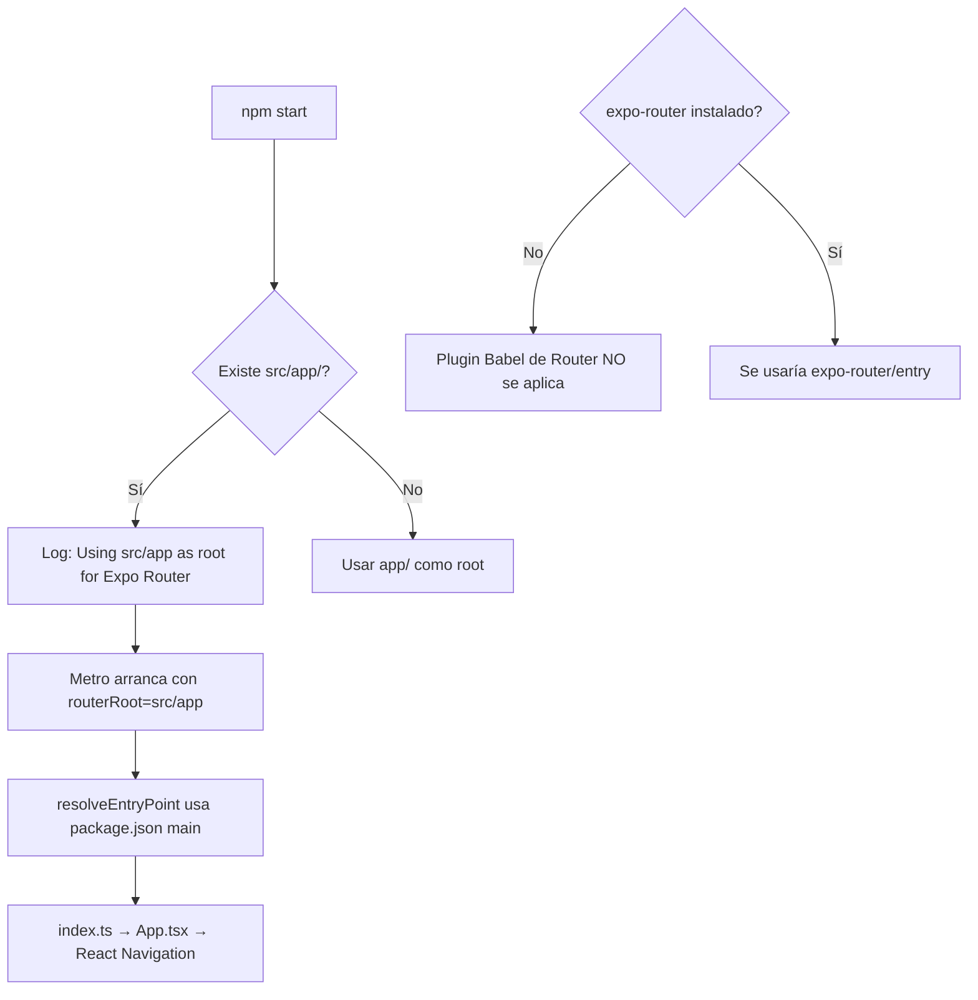

# Diagnóstico Expo Router y renombrado a src/navigation

### Prompt

Analizá el proyecto sin modificar nada todavía y devolvé un diagnóstico.
Problema: Expo 55 está usando Expo Router en lugar de React Navigation. El output de npm start muestra "Using src/app as the root directory for Expo Router", cuando debería usar App.tsx como entry point con React Navigation.
Lo que ya existe:

mobile/index.ts con registerRootComponent(App)
mobile/App.tsx que importa AppNavigator desde @/app/navigation/AppNavigator
mobile/app.json con "entryPoint": "./index.ts"
La arquitectura usa src/app/navigation/ para React Navigation, no Expo Router

Lo que necesito que analices:

Por qué Expo sigue detectando Expo Router a pesar del entryPoint en app.json
Qué archivo o configuración está causando que Expo tome src/app/ como root de Expo Router
Cuál es la forma correcta en Expo SDK 55 de deshabilitar Expo Router y usar React Navigation con entry point en index.ts

Restricciones:

No modificar archivos todavía
No instalar dependencias
No hacer commits

Al finalizar devolvé:

Causa raíz del problema
Archivos que hay que modificar
Cambios exactos a realizar
Cómo verificar que quedó resuelto

### Respuesta

## Diagnóstico

Revisé la configuración, el código fuente y el comportamiento interno de Expo CLI SDK 55 (`@expo/cli` / `@expo/metro-config`). El mensaje es engañoso: **Expo no está activando Expo Router como entry point**, pero **sí detecta `src/app/` como carpeta de rutas** por una heurística fija del CLI.

---

### Causa raíz

Hay **tres factores** que se combinan:

#### 1. Colisión de nombres con la convención de Expo SDK 55

En SDK 55, el template por defecto usa `src/app/` como directorio de rutas de **Expo Router** (no de React Navigation). El CLI aplica esta lógica:

```125:132:juntadas-app/mobile/node_modules/expo/node_modules/@expo/cli/build/src/start/server/metro/router.js
function getRouterDirectory(projectRoot) {
    // more specific directories first
    if ((0, _dir.directoryExistsSync)(_path().default.join(projectRoot, 'src', 'app'))) {
        logSrcDir();
        return _path().default.join('src', 'app');
    }
    debug('Using app as the root directory for Expo Router.');
    return 'app';
}
```

Solo comprueba si existe el directorio `src/app/`. **No verifica**:
- si `expo-router` está instalado
- si hay `_layout.tsx`, `index.tsx`, etc.
- si hay plugin `expo-router` en `app.json`
- si definiste un entry point custom

Tu proyecto tiene `src/app/navigation/` (React Navigation), y eso dispara el log:

```
Using src/app as the root directory for Expo Router.
```

#### 2. `entryPoint` en `app.json` no hace nada

`"entryPoint": "./index.ts"` **no es una propiedad válida** del schema de Expo en SDK 55. No aparece en `@expo/config` ni en la documentación oficial.

El entry point real lo resuelve `package.json`:

```5:5:juntadas-app/mobile/package.json
  "main": "index.ts",
```

Y `@expo/config/paths` usa exclusivamente `main` (o `./index` como fallback):

```95:107:juntadas-app/mobile/node_modules/@expo/config/build/paths/paths.js
  const {
    main
  } = pkg;
  if (main && typeof main === 'string') {
    const entry = (0, _requireUtils().resolveFrom)(projectRoot, main, {
      extensions
    });
    // ...
    return entry;
  }
```

Por eso `entryPoint` en `app.json` **no puede** desactivar Expo Router ni forzar `index.ts`.

#### 3. Expo Router no está realmente instalado ni activo

| Elemento | Estado |
|---|---|
| `expo-router` en `package.json` | No instalado |
| Plugin `expo-router` en `app.json` | No |
| Archivos de rutas (`_layout.tsx`, etc.) | No |
| Entry real | `index.ts` → `App.tsx` → `AppNavigator` (React Navigation) |
| Plugin Babel de Router | Solo se activa si existe el módulo `expo-router` |

El bundler sigue usando `index.ts` vía `resolveEntryPoint`. El mensaje es **informativo/falso positivo**, no implica que la app arranque con `expo-router/entry`.

---

### Qué está pasando en la práctica



Metro pasa `transform.routerRoot=src/app` al transformador, pero sin `expo-router` eso no cambia el entry ni aplica transforms de file-based routing.

---

### Archivos que hay que modificar

| Archivo / carpeta | Acción |
|---|---|
| `src/app/` | Renombrar o reestructurar (causa principal) |
| `App.tsx` | Actualizar import `@/app/navigation/...` |
| Cualquier archivo con `@/app/...` | Actualizar paths |
| `app.json` | Quitar `"entryPoint"` (opcional, no tiene efecto hoy) |
| `package.json` | Mantener `"main": "index.ts"` (ya está bien) |

No hace falta tocar `index.ts`, ni instalar nada, ni agregar config especial para “deshabilitar” Router.

---

### Cambios exactos recomendados

**Opción recomendada: renombrar `src/app` → `src/navigation`**

1. Mover el contenido:
   ```
   src/app/navigation/*  →  src/navigation/*
   ```
2. Eliminar la carpeta vacía `src/app/`.
3. En `App.tsx`, cambiar:
   ```tsx
   import { AppNavigator } from '@/navigation/AppNavigator';
   ```
4. Buscar y reemplazar imports `@/app/` → `@/navigation/` (o la ruta que elijas).
5. En `app.json`, eliminar la línea:
   ```json
   "entryPoint": "./index.ts",
   ```
   (redundante; el entry válido es `package.json` → `"main"`).

**Alternativas de nombre** (misma idea, evitar `src/app` o `app` en la raíz):
- `src/core/navigation/`
- `src/application/navigation/`

**Lo que NO funciona en SDK 55:**
- `"entryPoint"` en `app.json`
- Un flag tipo `disableExpoRouter` (no existe)
- `extra.router.root` apuntando a otra carpeta sin usar Expo Router (suprime el log pero mete ruido en Metro y no resuelve el conflicto semántico)

**Forma correcta de usar React Navigation con entry custom en SDK 55:**

```json
// package.json
"main": "index.ts"
```

```ts
// index.ts
import { registerRootComponent } from 'expo';
import App from './App';
registerRootComponent(App);
```

Sin `expo-router` en dependencias, sin plugin `expo-router`, y **sin carpeta `src/app/` ni `app/`** reservada para otra cosa.

---

### Cómo verificar que quedó resuelto

1. **Log de arranque**
   ```bash
   npm start
   ```
   No debe aparecer: `Using src/app as the root directory for Expo Router.`

2. **Entry point del bundle**
   - Metro debe resolver `index.ts` / `index.bundle`, no `expo-router/entry`.
   - En logs de debug (si los activás): `Resolved entry point` apuntando a `index.ts`.

3. **Runtime en Expo Go**
   - La app carga (aunque las pantallas sean `null` placeholders).
   - No errores del tipo “Unable to resolve expo-router” o “No routes found”.

4. **Estructura**
   ```bash
   # No debe existir
   src/app/
   ```

5. **Dependencias**
   ```bash
   npm ls expo-router
   ```
   Debe fallar o mostrar `(empty)` — confirma que Router no está en el árbol de dependencias directas.

---

### Resumen ejecutivo

| Pregunta | Respuesta |
|---|---|
| ¿Por qué Expo detecta Router? | Porque existe `src/app/`, reservado por convención en SDK 55 |
| ¿Qué lo causa? | Heurística en `@expo/cli` / `@expo/metro-config`, no tu `entryPoint` |
| ¿Está usando Router de verdad? | **No** — no tenés `expo-router` ni rutas file-based |
| ¿Cómo deshabilitarlo? | Renombrar `src/app/`; mantener `"main": "index.ts"` en `package.json` |
| ¿`entryPoint` en app.json? | Ignorado; no sirve para esto |

El conflicto es de **nomenclatura de carpetas**, no de configuración de entry point. Renombrar `src/app` elimina el falso positivo y evita problemas futuros si activás typed routes, web server rendering u otras features ligadas a Expo Router.

¿Querés que aplique estos cambios en el proyecto?

---

---

### Prompt

Aplica los cambios para solucionarlo

### Respuesta

Listo. Cambios aplicados:

**Estructura**
- `src/app/navigation/` → `src/navigation/`
- Eliminada la carpeta `src/app/`

**Imports**
- `App.tsx`: `@/app/navigation/AppNavigator` → `@/navigation/AppNavigator`

**Config**
- Quitado `"entryPoint": "./index.ts"` de `app.json` (no tenía efecto; el entry válido sigue siendo `"main": "index.ts"` en `package.json`)

**Verificación:** al arrancar Expo ya no aparece `Using src/app as the root directory for Expo Router.`

Reiniciá el dev server que tenés corriendo (`Ctrl+C` y `npm start`) para que tome los cambios.

---

### Archivos modificados

- `juntadas-app/mobile/App.tsx` — editado
- `juntadas-app/mobile/app.json` — editado


---

### Prompt

Me intente conectar con el celular y me dice Somethign went wrong pero no me sale error en la terminal

### Respuesta

El bundle llegó al celular; el fallo parece ser en runtime. Voy a rastrear qué lo provoca.

---

---

### Prompt

El error en el celu que me sale al escanear el QR  es el siguiente: "Uncaught Error: java.io.IOException: Failed to download remote update"

### Respuesta

Ese error **no es un bug de tu código**. Significa que **Expo Go en Android no puede descargar el bundle de JavaScript** desde tu PC (`192.168.1.38:8081`). Es un problema de **conectividad de red** entre el celular y Metro.

En la terminal sí hubo un bundle exitoso (`Android Bundled 33648ms`), así que Metro funciona; el celular a veces no llega a descargarlo bien.

---

### Causas más comunes

1. Celular y PC en **redes distintas** (WiFi invitado, datos móviles activos, VPN)
2. **Aislamiento de clientes** en el router (impide que dispositivos se vean entre sí)
3. **Firewall de Windows** bloqueando el puerto 8081
4. El tunnel falló porque `@expo/ngrok` no estaba instalado localmente (ya lo corregí)

---

### Qué probar (en este orden)

#### Opción A — USB (la más confiable en Windows)

1. Conectá el celular por USB con **depuración USB** activada
2. Ejecutá:
   ```bash
   npm run start:usb
   ```
3. Escaneá el QR o abrí la URL `exp://127.0.0.1:8081` en Expo Go

Esto evita depender del WiFi.

#### Opción B — WiFi (LAN)

1. Celular y PC en la **misma WiFi** (no red invitada)
2. **Desactivá datos móviles** en el celular al probar
3. Desactivá VPN en PC y celular
4. Reiniciá Metro:
   ```bash
   npm start
   ```
5. Escaneá el QR de nuevo

Si sigue fallando, en el router desactivá **AP Isolation / Client Isolation**.

#### Opción C — Tunnel (si WiFi no funciona)

```bash
npm run start:tunnel
```

Instalé `@expo/ngrok` como dependencia local del proyecto (el intento anterior falló porque lo instaló global y Expo no lo encontró). Si el tunnel tarda mucho, puede ser firewall o red corporativa bloqueando ngrok.

---

### Cómo saber que funcionó

En la terminal deberías ver algo como:

```
Android Bundled ... index.ts (1012 modules)
```

Si eso aparece y la app carga, el problema era solo de red.

---

### Extra (para cuando la app cargue)

Tu `.env` tiene la URL de Supabase con `/rest/v1/` al final. Debería ser solo:

```
https://tgxedyffizwbgidexpfj.supabase.co
```

Eso no causa este error de descarga, pero va a romper auth cuando la app arranque.

---

Probá primero **`npm run start:usb`** con el celular conectado por cable y contame qué pasa.

---

### Archivos modificados

- `juntadas-app/mobile/package.json` — editado


---

### Prompt

@c:\Users\nicop\.cursor\projects\c-Users-nicop-OneDrive-Escritorio-Facultad-4toA-o-Electivas-4to-Desarrollo-de-Aplicaciones-Moviles-1C-Juntadas-App\terminals\1.txt:45-52 .

### Respuesta

El error es porque **`adb` no estaba instalado** en tu PC. Ya lo instalé con winget (`Google.PlatformTools` v37.0.0) y actualicé el script `start:usb` para que verifique el celular antes de arrancar.

### Qué hacer ahora

1. **Cerrá y volvé a abrir la terminal** (para que tome el nuevo PATH con `adb`)
2. Conectá el celular por **USB**
3. En el celular: **Opciones de desarrollador → Depuración USB** activada, y aceptá el permiso cuando aparezca
4. Ejecutá:
   ```bash
   npm run start:usb
   ```
5. Escaneá el QR o abrí `exp://127.0.0.1:8081` en Expo Go

Si no hay celular conectado, el script te avisa en lugar de fallar con un error crípto.

### Si preferís WiFi (sin cable)

```bash
npm start
```

Asegurate de que celular y PC estén en la misma WiFi y que el celular no use datos móviles al escanear el QR.

---

### Archivos modificados

- `juntadas-app/mobile/scripts/start-usb.ps1` — editado
- `juntadas-app/mobile/package.json` — editado


---

### Prompt

Donde corro los comandos, en que ruta

### Respuesta

Todos los comandos van en la carpeta **`mobile`** del proyecto:

```
C:\Users\nicop\OneDrive\Escritorio\Facultad\4toAño\Electivas 4to\Desarrollo de Aplicaciones Moviles (1C)\Juntadas-App\juntadas-app\mobile
```

Ahí están `package.json`, `app.json`, `index.ts` y `App.tsx`.

### Cómo llegar

En PowerShell o la terminal de Cursor:

```powershell
cd "C:\Users\nicop\OneDrive\Escritorio\Facultad\4toAño\Electivas 4to\Desarrollo de Aplicaciones Moviles (1C)\Juntadas-App\juntadas-app\mobile"
```

### Comandos desde ahí

| Comando | Para qué |
|---|---|
| `npm start` | WiFi (misma red que el celular) |
| `npm run start:usb` | Celular conectado por USB |
| `npm run start:tunnel` | Si WiFi/USB no funcionan |

**No** los corras desde `Juntadas-App` ni desde `juntadas-app` (la carpeta padre), porque ahí no está el proyecto Expo.

---

---

### Prompt

Ejecute los tres comandos. El primero, el npm start, me estuvo cargando un tiempo y lo que me mostró al final es el mismo error que me viene mostrando, que es el java.lang.IllegalArgumentException. que es lo que me ha pasado anteriormente. Luego el NPM Run Start 2 puntos USB. No me toma como que está conectado el USB en el celular cuando sí lo está a través de un USB y luego el tercero el NPM run start dos puntos tunnel Me salió el siguiente error por pantalla: "Project is incompatible with this version of Expo Go. This project requires a newer version of Expo Go. How to fix this error: Download the latest version of Expo Go from the Play Store".

### Respuesta

---

---

### Prompt

Según lo que veo en opiniones y distintos problemas, al parecer hay versión 55 de ExpoGo en lo que es la aplicación de celular. La versión dice client version 54.0.8 y supported SDK 54.

### Respuesta

Exacto: ahí está el problema principal.

## Qué está pasando

| | Tu celular (Play Store) | Tu proyecto |
|---|---|---|
| **Expo Go** | Client 54.0.8 | — |
| **SDK soportado** | **54** | **55** |

El proyecto usa **Expo SDK 55** (`expo ~55.0.26`), pero la Expo Go de Play Store **todavía es SDK 54**. Por eso el tunnel te mostró el mensaje claro de incompatibilidad.

Los otros errores (`IllegalArgumentException`, `Failed to download remote update`) suelen ser **consecuencia del mismo desajuste**: Expo Go 54 intenta cargar un proyecto SDK 55 y falla.

**Actualizar Expo Go desde Play Store no alcanza** — la versión publicada sigue en SDK 54. No es un bug tuyo.

---

## Solución recomendada: instalar Expo Go SDK 55 en Android

No hace falta adb para esto. Desde el **celular**:

1. Abrí: [expo.dev/go — SDK 55, Android device](https://expo.dev/go?sdkVersion=55&platform=android&device=true)
2. Escaneá el QR de esa página **con el celular** (o descargá el APK directamente)
3. Instalá esa versión de Expo Go (puede pedirte permitir “orígenes desconocidos”)
4. Volvé a correr en la PC:
   ```bash
   npm run start:tunnel
   ```
   (el tunnel ya te funcionó; es la opción más confiable en tu red)
5. Escaneá el QR del tunnel con la **Expo Go SDK 55** recién instalada

En la app deberías ver algo como **Client version 55.x** y **Supported SDK 55**.

---

## Sobre `npm run start:usb`

Ese script depende de que **adb vea el celular**, y ahora mismo no lo detecta (`List of devices attached` vacío). Eso es aparte de la versión de Expo Go. Para que funcione:

- Cable de **datos** (no solo carga)
- Modo USB: **Transferencia de archivos (MTP)**
- **Opciones de desarrollador → Depuración USB** activada
- Aceptar el diálogo **“¿Permitir depuración USB?”** en el celular
- En algunos celulares (Samsung, Xiaomi, etc.) hay que instalar drivers USB en Windows

Hasta que `adb devices` muestre tu celular, `start:usb` no va a funcionar.

---

## Alternativa: bajar el proyecto a SDK 54

Si preferís seguir con la Expo Go de Play Store (54.0.8), habría que **downgrade del proyecto a SDK 54**. Es más invasivo (cambiar versiones de `expo`, `react-native`, etc.).

Para un proyecto de facultad con Expo Go, suele ser más simple **instalar Expo Go 55** como arriba.

---

## Resumen

- Tu diagnóstico es correcto: **Expo Go 54 ≠ proyecto SDK 55**
- Play Store no tiene SDK 55 todavía
- **Próximo paso:** instalá Expo Go SDK 55 desde [expo.dev/go](https://expo.dev/go?sdkVersion=55&platform=android&device=true) y usá `npm run start:tunnel`

Cuando lo instales, decime qué versión te muestra la app y si carga el proyecto.

---

---

### Prompt

al final el problema Era esa versión del celebrador, ahora me cargo correctamente y me muestra por pantalla. Que no sirve. Ya que el único probable. Era la versión. Del celular. Nada más.

### Respuesta

Confirmado: el problema era **Expo Go SDK 54 vs proyecto SDK 55**. Play Store todavía entrega la 54, por eso fallaba aunque Metro y el código estuvieran bien.

Con **Expo Go 55** instalada desde [expo.dev/go](https://expo.dev/go?sdkVersion=55&platform=android&device=true) y el tunnel (o LAN, si te funciona), el flujo queda correcto.

Si ves pantalla en blanco, es normal por ahora: las pantallas del navigator son placeholders que devuelven `null`. Eso ya es desarrollo de features, no un error de conexión.

Cuando quieras seguir con pantallas reales o Supabase, avisame.
